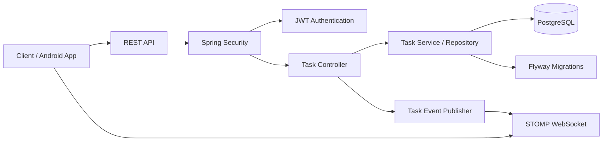
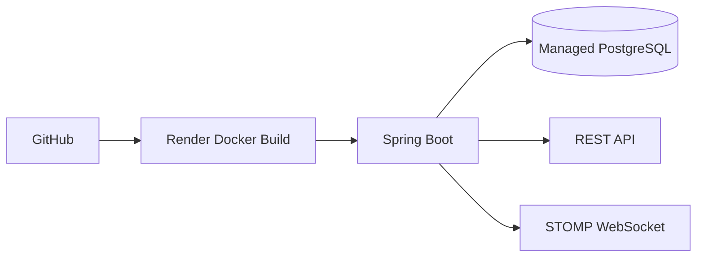

# TaskFlow — Secure Task Management Backend 🚀

TaskFlow is a **Kotlin + Spring Boot** backend for a secure task-management service. It includes user registration/login, BCrypt password hashing, JWT authentication, PostgreSQL persistence, authenticated task CRUD, validation, Flyway migrations, real-time task events over STOMP/WebSockets, Docker support, and CI test automation.

> **Status:** Backend MVP deployed on Render; Android client and AI-assisted features remain planned extensions.

## 🌐 Live Deployment

**TaskFlow API:** https://taskflow-api-b7f4.onrender.com

**Health check:** https://taskflow-api-b7f4.onrender.com/actuator/health

The production service runs on Render with PostgreSQL in the same region. Flyway migrations are applied automatically during startup.

## 🧱 System Architecture



## 🚀 Production Deployment Flow



## ✨ Implemented Features

- User registration and login
- BCrypt password hashing
- JWT-based stateless authentication
- Protected task endpoints
- User-owned task isolation
- Create, read, update, and delete tasks
- Bean Validation for request payloads
- API-level error handling
- Environment-based database and JWT configuration
- PostgreSQL persistence with Spring Data JPA
- Versioned database schema with Flyway
- STOMP WebSocket endpoint at `/ws`
- Per-user task events on `/topic/tasks/{email}`
- JWT unit tests
- Dockerized backend build
- GitHub Actions CI for automated tests
- Production deployment on Render

## 🛠️ Tech Stack

- **Kotlin 1.9.20**
- **Java 17**
- **Spring Boot 3.2**
- Spring Web
- Spring Security
- Spring Data JPA
- Spring Validation
- Spring WebSocket / STOMP
- PostgreSQL 16
- Flyway
- JJWT
- Kotlin Coroutines
- Docker
- GitHub Actions
- Render

## 🔌 API Overview

### Authentication

```http
POST /api/auth/register
POST /api/auth/login
```

Example registration body:

```json
{
  "email": "user@example.com",
  "password": "strong-password"
}
```

Authentication endpoints return a JWT token.

### Tasks

All task endpoints require:

```http
Authorization: Bearer <token>
```

```text
GET    /api/tasks
GET    /api/tasks/{id}
POST   /api/tasks
PUT    /api/tasks/{id}
DELETE /api/tasks/{id}
```

Task records are associated with the authenticated user, so users cannot retrieve or modify another user's tasks through the task API.

### WebSocket

Connect a STOMP client to:

```text
/ws
```

Subscribe to:

```text
/topic/tasks/{authenticated-user-email}
```

Task creation, update, and deletion publish lightweight events containing the operation type and task ID.

## 📁 Project Structure

```text
TaskFlow/
├── backend/
│   ├── build.gradle.kts
│   ├── Dockerfile
│   └── src/
│       ├── main/kotlin/com/taskflow/
│       │   ├── auth/
│       │   ├── security/
│       │   ├── task/
│       │   ├── user/
│       │   └── websocket/
│       ├── main/resources/
│       │   ├── application.yml
│       │   └── db/migration/
│       └── test/kotlin/com/taskflow/
├── android-app/
├── .github/workflows/backend-ci.yml
├── Dockerfile
├── render.yaml
├── .gitignore
├── LICENSE
└── README.md
```

## ▶️ Run Locally

### Prerequisites

- JDK 17+
- PostgreSQL
- Gradle 8.7+

Create a PostgreSQL database named `taskflow`, then configure environment variables:

```bash
DB_URL=jdbc:postgresql://localhost:5432/taskflow
DB_USERNAME=postgres
DB_PASSWORD=your-password
JWT_SECRET=your-long-random-secret
JWT_EXPIRATION_MS=86400000
```

From `backend`:

```bash
gradle bootRun
```

The API starts on port `8080` by default. Flyway applies versioned migrations automatically.

## 🐳 Docker

From the repository root:

```bash
docker build -t taskflow-api .
docker run --rm -p 8080:8080 \
  -e DB_URL=jdbc:postgresql://host.docker.internal:5432/taskflow \
  -e DB_USERNAME=postgres \
  -e DB_PASSWORD=your-password \
  -e JWT_SECRET=your-long-random-secret \
  taskflow-api
```

## 🧪 Testing & CI

Run tests locally:

```bash
gradle test
```

Every push and pull request targeting `main` runs the backend test suite through GitHub Actions.

## 🔐 Security Notes

- Passwords are stored as BCrypt hashes, never plaintext.
- JWT secrets and database credentials are read from environment variables.
- Task endpoints are stateless and protected by Spring Security.
- User-to-task ownership is enforced at repository/controller level.
- Do not commit real credentials or production JWT secrets.

## 📌 Roadmap

- [x] User registration/login
- [x] JWT authentication
- [x] Task CRUD
- [x] User-specific authorization
- [x] Request validation and API error handling
- [x] Flyway database migration
- [x] WebSocket task events
- [x] JWT unit tests
- [x] Dockerized backend
- [x] GitHub Actions CI
- [x] Production deployment
- [ ] Broader integration test suite
- [ ] Android client integration
- [ ] AI-assisted task functionality

## Author

**Rudra Pratap Singh**

GitHub: https://github.com/deadlyrps2802
